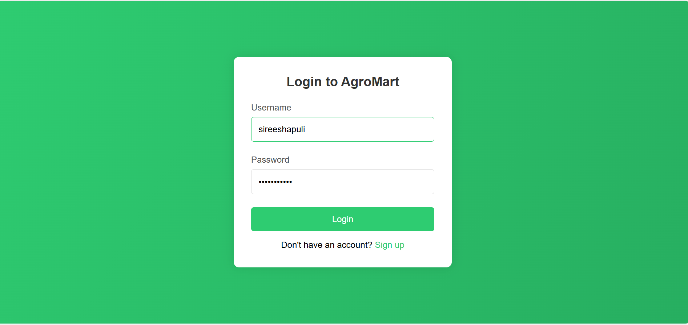
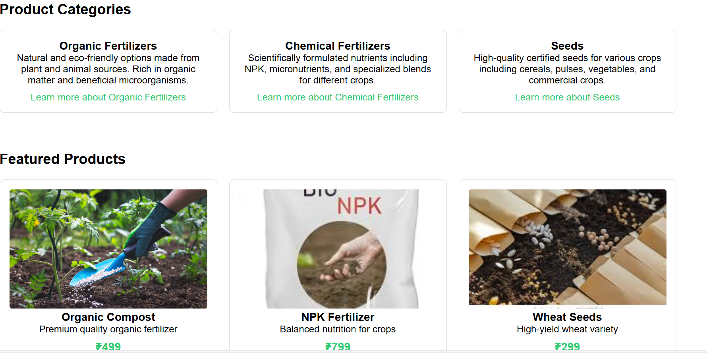
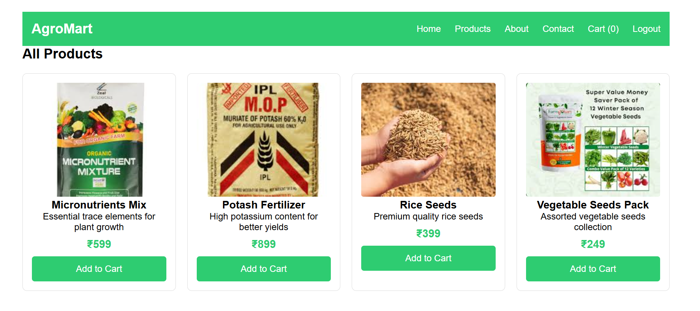
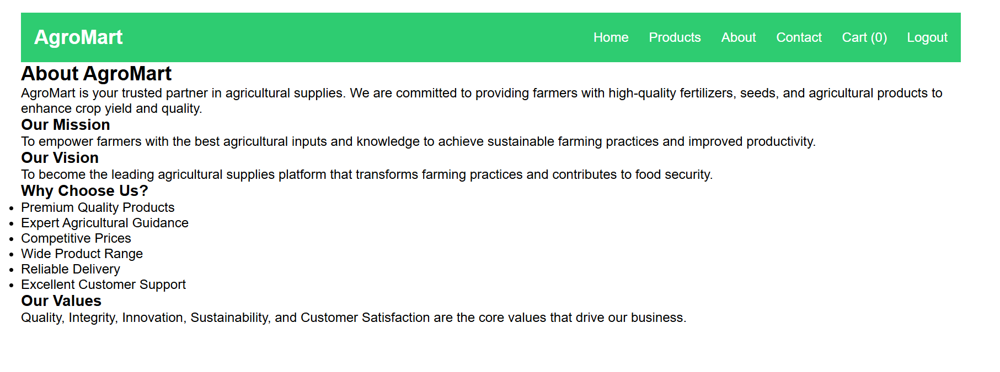
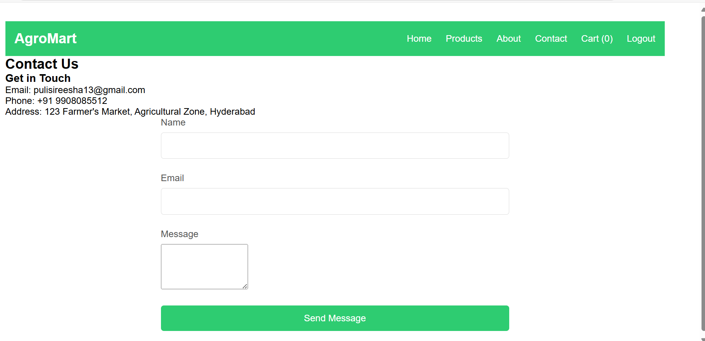
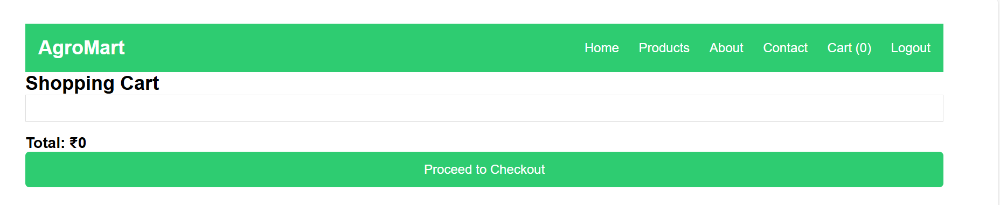

🌾 AgroMart - Farmer's Online Fertilizer and Seed Store
AgroMart is a user-friendly web application designed to help farmers purchase high-quality agricultural products like fertilizers and seeds from the comfort of their homes. The platform ensures ease of access to organic and chemical fertilizers, micronutrients, and certified crop seeds, along with detailed information and a seamless shopping experience.

🚀 Features
🔐 Login Authentication: Secure login interface for users.

🏪 Homepage: Attractive landing section featuring a hero image, description, and category overview.

🧪 Product Categories:

Organic Fertilizers

Chemical Fertilizers

Seeds

🛒 Shopping Cart: Add/remove products from the cart and view total pricing.

📄 Product Pages: View detailed product listings with images, names, descriptions, and prices.

📞 Contact Page: Users can reach out via the provided contact form or contact details.

📃 About Page: Displays AgroMart’s mission, values, and why customers should choose AgroMart.

📱 Responsive Design: Optimized for desktop and mobile devices.

💻 Tech Stack
HTML5

CSS3

JavaScript (Vanilla JS)

📸 Screenshots

📁 AgroMart
│
├── index.html         # Main HTML file
├── fertilizer1.jpg    # Image assets used on the homepage and product pages
├── fertilizer2.jpeg
├── seeds1.jpeg
├── mixture.jpeg
├── potash.jpeg
├── seed.jpeg
├── vegetables.jpeg
🛠️ Installation and Usage
Clone or download the project:
git clone https://github.com/your-username/agromart.git
Navigate into the folder and open index.html in your browser:
cd agromart
start index.html  # or just double-click the file

